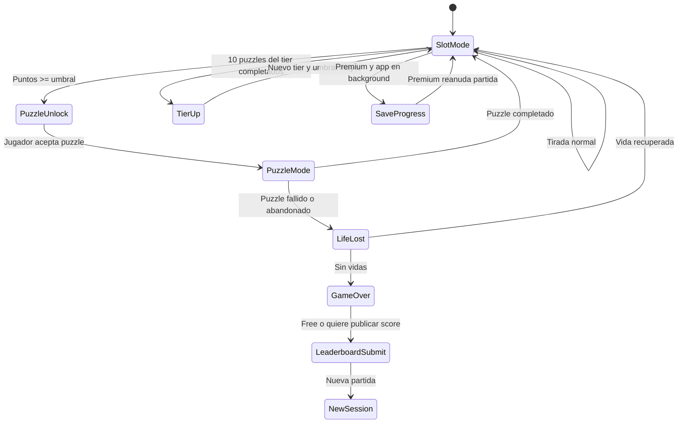
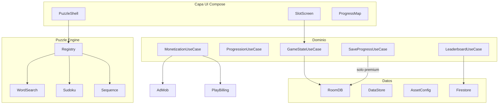
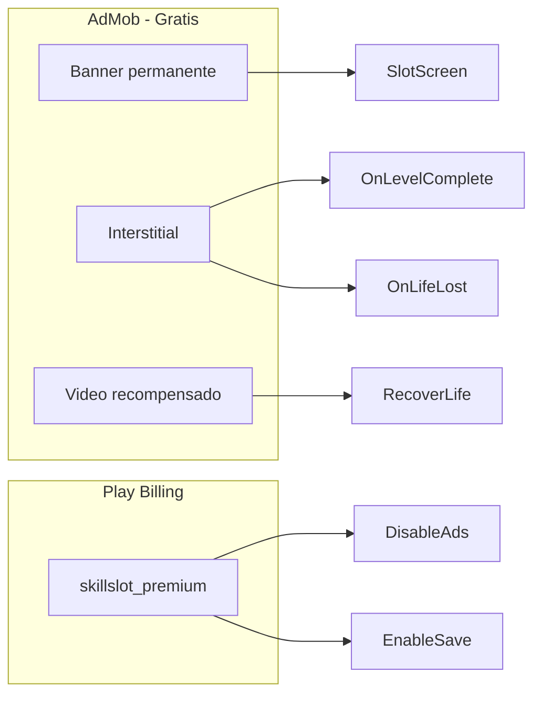

# SkillSlot — Arquitectura y alcance funcional

## Recomendación tecnológica (menor costo)

| Opción | Costo | Por qué |
|--------|-------|---------|
| **Kotlin + Jetpack Compose** | $0 | Android Studio, SDK y Play Console (cuota única ~$25) son los únicos gastos. AdMob y Play Billing tienen SDK oficial sin royalties. |
| Flutter | $0 | Válido si más adelante quieres iOS; para solo Android añade capa extra sin beneficio claro aquí. |
| Unity / Godot | $0 base | Motor de juego innecesario para puzzles 2D y tragamonedas ligeras; APK más pesado y curva de aprendizaje mayor. |

**Decisión:** Kotlin nativo + Jetpack Compose + MVVM + Hilt + Room + DataStore.

Herramientas gratuitas del stack:
- IDE: Android Studio
- Gráficos/UI: Compose (sin assets 3D costosos)
- Audio: efectos libres (freesound.org, OpenGameArt) o generados
- Backend ranking: **Firebase Firestore** (plan Spark gratuito; solo para leaderboard, no para progreso)
- Progreso guardado: **solo versión paga**, local con Room (sin costo de servidor)
- CI opcional: GitHub Actions (plan gratuito)
- Diseño: identidad visual que adjuntarás + Figma free tier

---

## Visión del producto

SkillSlot alterna dos modos en un mismo flujo:

1. **Modo tragamonedas** — el jugador acumula puntos con tiradas.
2. **Modo puzzle** — al alcanzar un umbral de puntos, se desbloquea un puzzle en pantalla.
3. Al completar el puzzle → sube de “nivel de puzzle” dentro del tier actual.
4. Tras completar los 10 tipos de puzzle del tier → sube **tier de dificultad** y el umbral de puntos entre puzzles aumenta.

### Dos modos de jugador (free vs premium)

| Capacidad | Versión gratuita | Versión paga (Premium) |
|-----------|------------------|------------------------|
| Jugar partida completa | Sí | Sí |
| Guardar progreso (tier, vidas, puzzles) | **No** — solo en memoria durante la sesión | **Sí** — persistencia local Room |
| Reanudar al cerrar la app | No | Sí |
| Anuncios | Sí (banner + intersticiales) | No |
| Ranking global | Sí — al terminar partida | Sí — opcional, no obligatorio |
| Mapa de progresión histórico | Solo de la sesión actual | Historial completo guardado |

**Incentivo de conversión:** el jugador free avanza en una sesión; si pierde todas las vidas o cierra la app, el progreso se pierde. La compra premium desbloquea guardado + elimina anuncios.



---

## Modelo de progresión (reglas de negocio)

### Variables principales

| Variable | Descripción | Ejemplo inicial |
|----------|-------------|-----------------|
| `slotPoints` | Puntos acumulados en tragamonedas (se consumen al entrar al puzzle) | 0 |
| `pointsThreshold` | Puntos necesarios para desbloquear el siguiente puzzle | 500 (tier 1) |
| `currentTier` | Dificultad global (1–10) | 1 |
| `completedPuzzlesInTier` | Índice 0–9 de puzzles ya superados en el tier | 0 |
| `lives` | Vidas actuales | 3 (máx. configurable) |
| `puzzleQueue` | Orden de los 10 tipos en el tier (puede ser fijo o rotado) | ver catálogo |

### Fórmulas sugeridas

```
pointsThreshold(tier) = baseThreshold × (1 + (tier - 1) × growthFactor)
  baseThreshold = 500
  growthFactor  = 0.5   → tier1: 500, tier2: 750, tier3: 1000, ...

puzzleDifficulty(tier, puzzleType) = tier   // 1–10 escala por tier
  // Cada puzzle implementa su propia escala interna (tamaño grid, tiempo, etc.)
```

### Flujo de puntos

- Cada tirada suma puntos según combinación (tabla de payout configurable en JSON local).
- Al desbloquear puzzle: **opción A (recomendada):** consumir `pointsThreshold` al iniciar el puzzle; **opción B:** solo requerir el umbral sin consumir. Definir en config; la opción A evita acumular infinitos puzzles.
- Tras completar puzzle: `completedPuzzlesInTier++`. Si llega a 10 → `currentTier++`, reset contador, recalcular umbral.

### Sistema de vidas

- Fallar puzzle (tiempo agotado, movimientos agotados, salir sin completar) → `-1 vida`.
- `lives == 0` → **Game Over**. Pantalla final con:
  - Puntuación de sesión (`sessionScore`) y resumen (tier alcanzado, puzzles completados).
  - **Ranking:** campo para ingresar alias (3–16 caracteres) y botón “Publicar en ranking”.
  - Opciones: ver video recompensado (+1 vida, solo si aún no es game over definitivo) o “Nueva partida”.
- En **free:** al game over la sesión termina; no hay reanudación.
- En **premium:** si aún tiene vidas o recupera una, continúa; el progreso se guarda automáticamente en cada cambio de estado.

### Puntuación de sesión (ranking)

Fórmula sugerida para ordenar el ranking:

```
sessionScore = (currentTier × 1000)
             + (completedPuzzlesInTier × 100)
             + (totalPuzzlesEverCompleted × 50)
             + (slotPoints / 10)
```

- Se calcula al llegar a Game Over o al abandonar voluntariamente (“Terminar partida”).
- Solo se publica si el jugador confirma con un alias válido.
- Un mismo dispositivo puede guardar un `localPlayerId` (UUID en DataStore) para asociar múltiples partidas al mismo jugador sin cuenta obligatoria.

---

## Arquitectura de software

### Estructura de módulos Gradle

```
skillslot/
├── app/                    # Application, navegación, tema, AdMob, Billing
├── core/
│   ├── model/              # GameState, PuzzleType, TierConfig, PayoutTable
│   ├── data/               # Room, DataStore, repositorios
│   └── domain/             # Use cases: SpinSlot, UnlockPuzzle, CompletePuzzle...
├── feature-slot/           # UI y lógica del tragamonedas
├── feature-puzzle/         # Shell del puzzle (timer, vidas, resultado)
├── feature-progression/    # Mapa de niveles, tiers, estadísticas
├── feature-leaderboard/    # Ranking global, game over, alias
├── puzzle-engine/          # Contrato común IPuzzle + PuzzleRegistry
└── puzzles/
    ├── puzzle-wordsearch/
    ├── puzzle-sudoku/
    ├── puzzle-ballsort/
    ├── puzzle-maze/
    ├── puzzle-boggle/
    ├── puzzle-memory/
    ├── puzzle-nonogram/
    ├── puzzle-sliding/
    ├── puzzle-connect/
    └── puzzle-sequence/
```

### Contrato de puzzles (extensibilidad)

Cada puzzle implementa una interfaz común para que el shell no dependa de tipos concretos:

```kotlin
interface IPuzzle {
    val type: PuzzleType
    fun createSession(difficulty: Int, seed: Long): PuzzleSession
}

interface PuzzleSession {
    val state: StateFlow<PuzzleUiState>
    fun onUserAction(action: PuzzleAction)
    val result: Flow<PuzzleResult>  // Completed | Failed(reason)
}
```

- **PuzzleRegistry:** mapa `PuzzleType → IPuzzle` inyectado con Hilt.
- **Generación procedural:** cada puzzle usa `seed` derivado de `(tier, puzzleIndex, userId)` para niveles reproducibles sin base de datos de niveles.
- **Dificultad:** parámetro `difficulty: Int (1–10)` que cada puzzle interpreta (ej. sudoku: más celdas vacías; laberinto: grid más grande).



### Persistencia según modo de jugador

| Dato | Free | Premium | Almacenamiento |
|------|------|---------|----------------|
| Progreso de partida (tier, vidas, puzzles) | Solo en RAM (`SessionState`) | Persistido | Room |
| Flag premium + compra IAP | — | Sí | DataStore |
| Alias / `localPlayerId` | Sí | Sí | DataStore |
| Preferencias (sonido, vibración) | Sí | Sí | DataStore |
| Tablas de payout, umbrales | Sí | Sí | JSON en `assets/` |
| Entradas de ranking | — | — | Firebase Firestore (nube) |

**`SaveProgressUseCase`:** intercepta cambios de `GameState` y escribe en Room solo si `isPremium == true`. Al iniciar la app:
- Premium → restaura último `SavedGameState` desde Room.
- Free → siempre inicia `SessionState` nueva (tier 1, vidas 3, puntos 0).

### Ranking global (Firebase Firestore — tier gratuito)

Colección `leaderboard`:

```json
{
  "alias": "VegasKing",
  "playerId": "uuid-local-opcional",
  "sessionScore": 2850,
  "tierReached": 2,
  "puzzlesCompleted": 8,
  "timestamp": "2026-06-23T12:00:00Z"
}
```

- Consulta: top 100 ordenado por `sessionScore` descendente.
- Escritura: solo al confirmar alias en pantalla Game Over.
- Validación cliente: alias 3–16 chars, sin solo espacios, filtro básico de palabras.
- Anti-spam básico (v1): máximo 3 envíos por `playerId` por día (regla Firestore Security Rules).
- **Costo:** plan Spark de Firebase ($0) cubre cómodamente un juego indie con miles de jugadores activos en ranking.

Módulo `core/data/leaderboard/` con `LeaderboardRepository` abstrae Firestore; intercambiable en tests con implementación fake.

---

## Alcance funcional por pantallas

### 1. Splash / Bootstrap
- Cargar config, verificar IAP premium, inicializar AdMob y Firebase.
- **Premium:** restaurar `SavedGameState` desde Room.
- **Free:** crear `SessionState` nueva en memoria.

### 2. Pantalla principal — Tragamonedas
- Rodillos (3×3 o 5×3), botón SPIN, contador de puntos, barra de progreso hacia siguiente puzzle.
- Indicador de vidas, tier actual, puzzle X/10.
- Banner AdMob fijo en **zócalo inferior** (mejor UX en móvil que laterales).
- Animación ligera: rotación de símbolos con `Animatable` en Compose (sin motor 3D).

### 3. Overlay “Puzzle desbloqueado”
- Modal cuando `slotPoints >= pointsThreshold`.
- CTA: “Jugar puzzle” / “Seguir en tragamonedas” (opcional, con límite de acumulación si no consumes puntos).

### 4. Shell de puzzle (común a los 10 tipos)
- Header: timer, vidas, botón pausa/abandonar.
- Área del puzzle (Composable del módulo específico).
- Al completar: interstitial (si no es premium) → pantalla de victoria → vuelta a slots.
- Al fallar: interstitial (si no es premium) → ofrecer video por vida.

### 5. Mapa de progresión
- Grid 10 puzzles × tier actual; iconos bloqueados/desbloqueados/completados.
- **Free:** refleja solo la sesión en curso.
- **Premium:** muestra historial de tiers completados (datos persistidos).

### 6. Game Over + Ranking
- Resumen de la partida: tier alcanzado, puzzles superados, `sessionScore`.
- Input de **alias** (o edición del alias guardado en DataStore).
- Botón “Publicar en ranking” → `LeaderboardUseCase.submitScore()`.
- Mensaje de éxito con posición estimada (ej. “¡Quedaste #42!”).
- CTA: “Nueva partida” / “Ver ranking” / “Hazte Premium para guardar progreso”.

### 7. Pantalla Ranking
- Top 100 jugadores: posición, alias, puntuación, tier alcanzado.
- Destacar entrada del jugador local si está en la lista.
- Accesible desde menú principal y desde Game Over.

### 8. Tienda / Premium
- Producto único IAP: `skillslot_premium` (no consumible).
- **Incluye:** eliminar anuncios + **guardar y reanudar progreso**.
- Restaurar compras.
- Sin suscripción en v1 (menor complejidad legal y de mantenimiento).
- Copy de venta: “Juega sin interrupciones y continúa donde lo dejaste”.

### 9. Ajustes
- Sonido, vibración, alias predeterminado, restaurar compras, créditos, política de privacidad (requerida por AdMob y Firebase).

---

## Catálogo de 10 puzzles

| # | Tipo | Mecánica | Escala de dificultad (tier 1 → 10) |
|---|------|----------|-------------------------------------|
| 1 | **Sopa de letras** | Encontrar N palabras en grid | Grid 8×8 → 14×14; más palabras y diagonales |
| 2 | **Sudoku** | Completar grid 9×9 | Más celdas vacías; menos pistas visibles |
| 3 | **Tubos de colores** | Ball sort clásico | Más colores, menos tubos vacíos |
| 4 | **Laberinto** | Arrastrar dedo de entrada a salida | Grid más grande, calles más estrechas |
| 5 | **Búsqueda en lienzo** | Unir letras adyacentes (estilo Boggle) | Grid mayor, palabras más largas/raras |
| 6 | **Memory / Parejas** | Voltear cartas temáticas casino | Más pares, menos tiempo |
| 7 | **Nonogram** | Revelar imagen por pistas numéricas | Grids 5×5 → 15×15 |
| 8 | **Sliding puzzle** | Ordenar piezas 3×3 → 5×5 | Más piezas, imagen más compleja |
| 9 | **Conectar puntos** | Unir números sin cruzar líneas | Más nodos, grids más densos |
| 10 | **Secuencia luminosa** | Repetir patrón tipo Simon | Secuencias más largas, más colores |

Rotación sugerida por tier: orden fijo 1→10 la primera vez; en replays opcional shuffle con seed.

---

## Tragamonedas — diseño ligero

### Mecánica
- **RNG:** `kotlin.random` con seed opcional para debug.
- **Símbolos:** 6–8 iconos vectoriales (frutas, sietes, diamantes) acordes a identidad púrpura/oro.
- **Líneas de pago:** 3–5 líneas en grid 3×3 o 5 líneas en 5×3.
- **Payout table** en JSON; RTP objetivo ~85–92% (ajustable sin redeploy si usas Remote Config más adelante; en v1 JSON local).

### Puntos por tirada (ejemplo)

| Resultado | Puntos |
|-----------|--------|
| Sin premio | 10–30 |
| Par | 50 |
| Trío | 150 |
| Línea completa | 300–500 |
| Jackpot | 1000 |

Con umbral 500, una sesión típica requiere ~15–25 tiradas antes del primer puzzle (ajustable en playtesting).

---

## Monetización



| Formato | Momento | Condición |
|---------|---------|-----------|
| **Banner** | Zócalo en tragamonedas y mapa | `!isPremium` |
| **Interstitial** | Tras completar puzzle (antes de volver a slots) | `!isPremium`, cooldown ≥60s |
| **Interstitial** | Tras perder vida | `!isPremium`, cooldown |
| **Rewarded** | Recuperar 1 vida | Siempre disponible |
| **IAP Premium** | Sin anuncios + guardado de progreso | Producto no consumible |

Capa `AdsManager` / `BillingManager` / `PremiumManager` desacoplada. `PremiumManager.isPremium` controla tanto anuncios como `SaveProgressUseCase`.

**Propuesta de valor premium (doble beneficio):**
1. Eliminar banner e intersticiales.
2. Guardar progreso y reanudar partida — el ranking sigue disponible para todos.

**Costos de monetización:** $0 hasta que generes ingresos; Google se queda con % de AdMob/IAP.

---

## Identidad visual (integración)

Cuando adjuntes el sistema de diseño:

- Tema Compose `SkillSlotTheme` con tokens: `ElectricPurple`, `GoldAccent`, `SurfaceDark`, tipografías.
- Componentes reutilizables: `SkillSlotButton`, `ProgressBar`, `LifeIndicator`, `PuzzleCard`.
- Iconos: Material Symbols + assets custom mínimos (SVG → Vector Drawable).

Sin animaciones pesadas: transiciones Compose (`AnimatedContent`, `Crossfade`), partículas opcionales solo en jackpot.

---

## Paquetes y permisos Android

- `minSdk 26`, `targetSdk` actual (35).
- Permisos: `INTERNET`, `ACCESS_NETWORK_STATE` (AdMob + Firebase).
- `google-services.json` para Firebase (proyecto gratuito en console.firebase.google.com).
- ProGuard rules para AdMob y Billing.
- Política de privacidad y consentimiento GDPR/UMP (AdMob User Messaging Platform, gratis).

---

## Roadmap de implementación (post-arquitectura)

Fases incrementales hacia el producto completo; cada fase es jugable.

| Fase | Entregable | Puzzles |
|------|------------|---------|
| **0 — Fundación** | Proyecto, tema, navegación, Room, GameState, módulos | 0 |
| **1 — Core loop** | Tragamonedas funcional + progresión + 1 puzzle (sopa de letras) | 1 |
| **2 — Shell puzzle** | Timer, vidas, victoria/derrota, transiciones | 1 |
| **3 — Monetización** | Banner, interstitial, rewarded, IAP premium (sin ads + guardado) | 1 |
| **3b — Ranking** | Firebase Firestore, Game Over con alias, pantalla top 100 | 1 |
| **4 — Puzzles 2–5** | Sudoku, tubos, laberinto, búsqueda lienzo | 5 |
| **5 — Puzzles 6–10** | Memory, nonogram, sliding, conectar, secuencia | 10 |
| **6 — Progresión completa** | 10 tiers, balanceo payout/umbrales, mapa | 10 |
| **7 — Pulido** | Sonido, tutorial, analytics locales, Play Store listing | 10 |

Estimación orientativa (1 dev, tiempo parcial): fase 0–3 ~4–6 semanas; producto completo ~3–5 meses.

---

## UX tragamonedas — roadmap pendiente

Fase 1 (implementada): reels escalonados, overlay de premio (+pts / winLabel), resaltado de línea ganadora, tabla de pagos colapsable, skin de marca en pantalla slot.

| Fase | Entregable | Estado |
|------|------------|--------|
| **Slot UX 1** | Reels por columna, overlay de victoria, paytable, botón SPIN circular de marca, mega jackpot header, payline dorada, cabina estilo referencia visual | Hecho |
| **Slot UX 2 — Retención** | “Casi puzzle” (>80% progreso), racha de sesión / mejor del día, desbloqueo de puzzle festivo (no AlertDialog), sonido + haptics en spin/win (respetando ajustes) | Pendiente |
| **Slot UX 3 — Profundidad** | Jackpot progresivo o mega bonus visual, variantes de máquina por tier, micro-eventos (“doble pts próximos 3 spins”) | Pendiente |

---

## Riesgos y mitigaciones

| Riesgo | Mitigación |
|--------|------------|
| Scope de 10 puzzles es grande | Contrato `IPuzzle` + un puzzle por sprint |
| Balanceo slot/puzzle aburrido o frustrante | JSON de config + playtesting temprano |
| Rechazo Play Store por gambling | Sin dinero real; “puntos” ficticios; clasificación Puzzle/Casual |
| Tamaño APK | Módulos dinámicos opcionales por puzzle si crece mucho |
| Spam en ranking | Alias validado + límite de envíos por `playerId`/día en Firestore Rules |
| Frustración free al perder progreso | Mensaje claro de premium + ranking como recompensa de sesión |
| Costo Firebase | Plan Spark gratuito; solo leaderboard, sin sincronizar progreso |

---

## Próximos pasos (cuando apruebes el plan)

1. Crear repositorio y estructura de módulos Gradle en una carpeta dedicada (ej. `C:\Users\usuario\SkillSlot`).
2. Implementar `core:model`, `GameState` y tema base con placeholders púrpura/oro.
3. Integrar tragamonedas mínimo viable y un primer puzzle para validar el loop.
4. Integrar identidad visual cuando la adjuntes.
